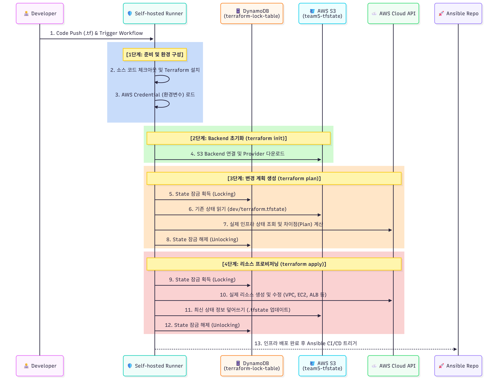

# AWS K3s Infrastructure Automation Platform

Terraform을 활용하여 AWS 환경에 K3s 기반 클러스터 인프라를 구축하고, GitHub Actions를 통해 인프라 배포를 자동화한 팀 프로젝트입니다.

## Architecture


본 프로젝트는 AWS VPC 환경에서 Public / Private Subnet을 분리하고, Bastion Host를 중심으로 K3s 클러스터, ALB, GitHub Actions 기반 자동화 환경을 구축하였습니다.

---

## Overview

본 프로젝트는 Infrastructure as Code(IaC)를 기반으로 AWS 인프라를 자동 구축하고 Kubernetes(K3s) 운영 환경을 구성하는 것을 목표로 합니다.

Terraform을 활용하여 네트워크, 컴퓨팅 자원, 보안 그룹 및 로드밸런서를 코드로 관리하며, GitHub Actions를 통해 인프라 배포 자동화를 구현하였습니다.

---

## Key Features

### Infrastructure as Code

* Terraform 기반 AWS 인프라 자동 구축
* VPC, Subnet, Security Group 코드 관리
* 재현 가능한 인프라 환경 제공

### Layered Infrastructure

* `01-infra` 와 `02-k3s-cluster` 구조 분리
* 인프라 의존성을 고려한 단계별 배포
* Remote State 기반 데이터 공유

### Secure Architecture

* Bastion Host 기반 접근 제어
* Public / Private Subnet 분리
* Security Group Chaining 적용

### Automated Deployment

* GitHub Actions 기반 자동 배포
* Terraform Workflow 자동화
* S3 Backend 및 DynamoDB Lock 적용

---

## Workflow

1. Terraform으로 AWS 네트워크 생성
2. Bastion Host 및 K3s 노드 생성
3. ALB 및 Target Group 구성
4. GitHub Actions Workflow 실행
5. Terraform Apply 자동 수행
6. K3s 클러스터 운영 환경 구성

---

## Terraform CI/CD Pipeline



GitHub Actions와 Self-hosted Runner를 활용하여 Terraform 인프라 배포를 자동화하였습니다.

코드 변경 시 Workflow가 실행되며 Terraform Init, Plan, Apply 단계를 수행하여 AWS 인프라를 자동으로 프로비저닝합니다.

또한 S3 Backend와 DynamoDB Lock을 활용하여 Terraform State를 안전하게 관리하고 협업 환경에서의 상태 충돌을 방지하였습니다.

---

## Infrastructure Components

| Component    | Description              |
| ------------ | ------------------------ |
| VPC          | 10.0.0.0/16              |
| Bastion Host | 관리 및 접근 서버               |
| K3s Master   | Kubernetes Control Plane |
| Web Worker   | Application Node         |
| DB Worker    | Database Node            |
| ALB          | External Load Balancer   |
| S3 Backend   | Terraform State Storage  |
| DynamoDB     | State Lock               |

---

## Repository Structure

```text
.
├── .github
│   └── workflows
│       ├── 01-infra-apply.yml
│       └── 02-k3s-apply.yml
│
├── 01-infra
│   ├── bastion.tf
│   ├── network.tf
│   ├── outputs.tf
│   ├── provider.tf
│   ├── security.tf
│   ├── user_data.sh
│   └── variables.tf
│
├── 02-k3s-cluster
│   ├── alb.tf
│   ├── compute.tf
│   ├── data_remote.tf
│   ├── outputs.tf
│   ├── provider.tf
│   ├── security.tf
│   └── variables.tf
│
├── docs
│   ├── architecture.png
│   └── terraform-cicd-flow.png
│
└── README.md
```

## Tech Stack

| Category         | Technology        |
| ---------------- | ----------------- |
| Cloud            | AWS EC2, VPC, ALB |
| IaC              | Terraform         |
| State Management | AWS S3, DynamoDB  |
| CI/CD            | GitHub Actions    |
| OS               | Ubuntu 22.04      |

---

## Results

* AWS 인프라 자동 구축 완료
* Layered Infrastructure 구현
* Secure Network Architecture 구성
* GitHub Actions 기반 Terraform CI/CD 구축
* S3 Backend 및 DynamoDB Lock 기반 State 관리 구현
* Remote State 기반 협업 환경 구축
* K3s 클러스터 운영을 위한 AWS 기반 인프라 환경 제공

---
